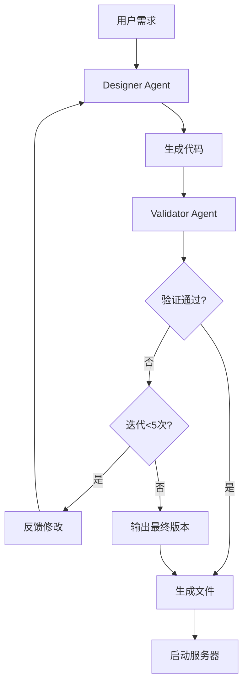

# 高保真原型设计Agent部署指南

## 项目概述

✅ **项目已完成开发**

这是一个基于LangGraph和LangSmith的高保真原型设计系统，包含Designer和Validator两个角色，能够根据用户需求自动生成HTML、CSS和JavaScript代码。

## 项目结构

```
prototype_design/
├── README.md                    # 项目文档
├── __init__.py                  # 包初始化
├── main.py                      # 命令行入口
├── graph.py                     # LangGraph工作流
├── state.py                     # 状态定义
├── server.py                    # 本地服务器
├── requirements.txt             # 依赖包
├── setup.py                     # 安装脚本
├── start.sh                     # 启动脚本
├── run_example.py               # 快速演示
├── test_workflow.py             # 测试脚本
├── agents/                      # Agent模块
│   ├── __init__.py
│   ├── designer.py              # Designer Agent
│   ├── validator.py             # Validator Agent
│   └── tools.py                 # 工具函数
├── templates/                   # 模板文件
│   └── base.html               # 基础HTML模板
├── examples/                    # 使用示例
│   └── simple_usage.py         # 简单使用示例
└── outputs/                     # 生成的原型文件
    └── .gitkeep
```

## 核心功能

### 1. Designer Agent
- 🎨 基于GPT-4的智能设计师
- 📱 生成响应式HTML、CSS、JavaScript代码
- 🔄 支持需求解析和代码生成
- ✨ 现代化UI设计风格

### 2. Validator Agent
- 🔍 多维度质量验证
- 📊 功能完整性检查
- 🎯 UI/UX设计评估
- 🔧 代码质量验证

### 3. 工作流特性
- 🔄 最多5次迭代优化
- 🌐 自动启动本地服务器
- 📈 LangSmith监控集成
- 💾 状态持久化

## 快速开始

### 1. 环境准备

```bash
# 复制并编辑配置文件
cp .env.example .env

# 编辑.env文件，填入您的DashScope API密钥
# DASHSCOPE_API_KEY=your_dashscope_api_key_here
```

### 2. 安装依赖

```bash
cd agent-frameworks/langgraph/prototype_design
pip install -r requirements.txt
```

### 3. 快速演示

```bash
# 方法1: 使用启动脚本
chmod +x start.sh
./start.sh

# 方法2: 直接运行演示
python3 run_example.py

# 方法3: 交互式模式
python3 run_example.py interactive
```

### 4. 命令行使用

```bash
# 生成原型
python3 -m prototype_design.main design "创建一个现代化的登录页面"

# 交互模式
python3 -m prototype_design.main design "设计一个仪表板" --interactive

# 启动服务器
python3 -m prototype_design.main server

# 查看已生成的原型
python3 -m prototype_design.main list
```

### 5. Python API使用

```python
from prototype_design.graph import PrototypeDesignWorkflow

# 创建工作流
workflow = PrototypeDesignWorkflow()

# 运行设计
result = workflow.run("创建一个博客文章列表页面")

if result["success"]:
    print(f"原型地址: {result['prototype_url']}")
else:
    print(f"设计失败: {result['error']}")
```

## 测试验证

```bash
# 运行完整测试
python3 test_workflow.py

# 测试基本功能
python3 -c "
from prototype_design.graph import PrototypeDesignWorkflow
workflow = PrototypeDesignWorkflow()
result = workflow.run('创建一个简单的按钮')
print('测试结果:', result['success'])
"
```

## 支持的原型类型

- 📝 **表单类**: 登录、注册、联系表单
- 📊 **仪表板**: 数据展示、管理后台
- 🛒 **电商类**: 产品展示、购物车
- 📰 **内容类**: 博客、文章列表
- 🧭 **导航类**: 菜单、页面导航

## 技术架构

### LangGraph工作流


### 集成监控
- 🔍 LangSmith追踪
- 📊 执行可视化
- 🐛 错误调试
- 📈 性能监控

## 故障排除

### 常见问题

1. **导入错误**
   ```bash
   # 确保在正确目录
   cd agent-frameworks/langgraph/prototype_design
   
   # 检查Python路径
   export PYTHONPATH="${PYTHONPATH}:$(pwd)/../../../.."
   ```

2. **API密钥错误**
   ```bash
   # 检查环境变量
   echo $OPENAI_API_KEY
   
   # 重新设置
   export OPENAI_API_KEY="your-key"
   ```

3. **端口占用**
   ```bash
   # 使用其他端口
   python3 -m prototype_design.main server --port 9000
   ```

4. **依赖问题**
   ```bash
   # 重新安装依赖
   pip install --upgrade -r requirements.txt
   ```

## 性能优化

### 建议配置
- Python 3.8+
- 内存: 4GB+
- 网络: 稳定连接
- 浏览器: Chrome/Firefox/Safari/Edge

### 监控建议
- 启用LangSmith追踪
- 监控API调用次数
- 观察响应时间
- 检查错误率

## 扩展开发

### 添加新的原型类型
1. 在`agents/tools.py`中扩展`parse_requirements`
2. 在`agents/designer.py`中添加新的模板
3. 在`agents/validator.py`中添加验证规则

### 自定义验证规则
1. 修改`ValidatorAgent`类
2. 添加新的验证维度
3. 更新验证提示词

### 集成新的LLM
1. 修改`DesignerAgent`和`ValidatorAgent`的模型配置
2. 更新API调用方式
3. 调整提示词格式

## 部署建议

### 开发环境
- 使用本地服务器
- 启用详细日志
- 使用交互模式调试

### 生产环境
- 配置负载均衡
- 使用Redis缓存
- 监控API配额
- 设置错误告警

## 联系支持

如有问题，请：
1. 查看README.md文档
2. 运行测试脚本诊断
3. 检查LangSmith追踪日志
4. 提交Issue报告

---

🎉 **恭喜！高保真原型设计Agent已成功部署完成！**

现在您可以开始使用这个强大的AI驱动的原型设计系统了。
