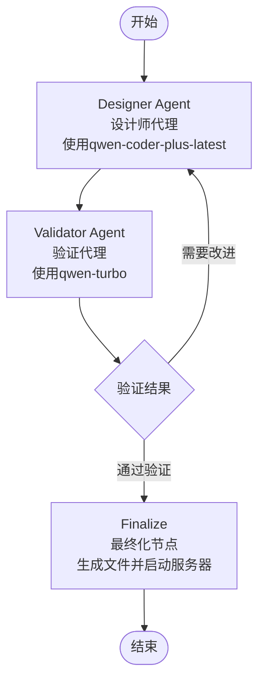

# LangGraph Studio 使用指南

## 🎯 概述

LangGraph Studio 现在已经配置完成，您可以通过可视化界面与原型设计Agent进行交互。

## 🌐 访问地址

- **🎨 LangGraph Studio**: https://smith.langchain.com/studio/?baseUrl=http://127.0.0.1:2024
- **🚀 API服务器**: http://127.0.0.1:2024
- **📚 API文档**: http://127.0.0.1:2024/docs

## 📝 输入字段说明

### ✅ 必填字段

- **Requirements** (需求描述): 这是唯一必填的字段，请输入您的原型需求
  - 示例: "创建一个现代化的登录页面，包含用户名、密码输入框和登录按钮"

### 🔧 可选字段（已设置默认值）

以下字段都有默认值，您无需填写：

- **Messages**: 对话消息历史 (默认: 空数组)
- **Html Code**: 生成的HTML代码 (默认: 空字符串)
- **Css Code**: 生成的CSS代码 (默认: 空字符串)
- **Js Code**: 生成的JavaScript代码 (默认: 空字符串)
- **Validation Result**: 验证结果 (默认: 空字符串)
- **Validation Feedback**: 验证反馈 (默认: 空字符串)
- **Iteration Count**: 迭代次数 (默认: 0)
- **Is Approved**: 是否通过验证 (默认: false)
- **Prototype Url**: 原型访问地址 (默认: 空字符串)
- **Current Agent**: 当前执行的agent (默认: "start")

## 🚀 快速开始

### 1. 打开LangGraph Studio
访问: https://smith.langchain.com/studio/?baseUrl=http://127.0.0.1:2024

### 2. 选择图形
在左侧选择 `prototype_design` 图形

### 3. 输入需求
在 **Requirements** 字段中输入您的需求，例如：
```
创建一个响应式的产品展示页面，包含：
1. 产品图片轮播
2. 产品标题和描述
3. 价格显示
4. 购买按钮
5. 用户评价区域
```

### 4. 运行工作流
点击 **Submit** 按钮开始执行

### 5. 观察执行过程
在图形视图中观察：
- Designer Agent 生成代码
- Validator Agent 验证质量
- 条件分支决定是否需要重新设计
- Finalize 节点生成最终文件

## 🎨 工作流程图



## 💡 使用技巧

### 1. 需求描述最佳实践
- **具体明确**: 详细描述功能需求
- **包含样式**: 说明设计风格偏好
- **响应式**: 提及是否需要移动端适配
- **交互性**: 说明需要的交互功能

### 2. 示例需求
```
创建一个现代化的仪表板页面，要求：
- 使用深色主题
- 包含数据图表区域
- 左侧导航菜单
- 顶部状态栏
- 响应式设计
- 使用CSS Grid布局
```

### 3. 监控执行
- 观察每个节点的执行状态
- 查看生成的代码质量
- 注意迭代次数和改进建议

## 🔧 调试功能

### 1. 断点设置
- 在任意节点设置断点
- 检查中间状态
- 逐步执行工作流

### 2. 状态检查
- 查看每个步骤的输入输出
- 监控状态变化
- 分析执行路径

### 3. 错误处理
- 查看错误日志
- 分析失败原因
- 调整输入参数

## 📊 输出结果

成功执行后，您将获得：

1. **HTML代码**: 完整的页面结构
2. **CSS代码**: 样式定义
3. **JavaScript代码**: 交互功能
4. **原型URL**: 可访问的预览地址
5. **验证报告**: 质量评估结果

## 🛠️ 故障排除

### 常见问题

1. **连接失败**
   - 确保LangGraph服务器正在运行
   - 检查端口2024是否可用

2. **执行错误**
   - 检查.env配置
   - 确认API密钥有效
   - 查看服务器日志

3. **生成质量不佳**
   - 优化需求描述
   - 增加具体细节
   - 尝试不同的表达方式

### 重启服务器
如果遇到问题，可以重启LangGraph服务器：
```bash
# 停止当前服务器 (Ctrl+C)
# 重新启动
langgraph dev --no-browser
```

## 🎉 享受体验

现在您可以通过LangGraph Studio享受可视化的AI原型设计体验！

- 实时观察AI思考过程
- 交互式调试和优化
- 直观的工作流可视化
- 专业的代码生成质量

祝您使用愉快！🚀
