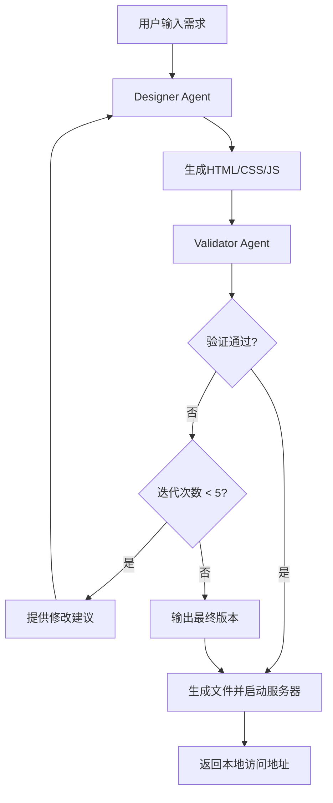

# 高保真原型设计Agent

这是一个基于LangGraph和LangSmith的高保真原型设计系统，包含Designer和Validator两个角色，能够根据用户需求自动生成HTML、CSS和JavaScript代码，并提供验证和迭代优化功能。

## 功能特性

- 🎨 **智能设计**: 基于GPT-4的Designer Agent，能够理解用户需求并生成高质量的前端代码
- 🔍 **多模态验证**: Validator Agent使用通义千问VL-Plus多模态模型，通过浏览器截图进行视觉验证
- 🖥️ **浏览器自动化**: 集成Playwright自动化测试，真实渲染页面并截图分析
- 🔄 **迭代优化**: 支持最多5次迭代，根据验证反馈持续改进
- 🌐 **本地预览**: 自动启动HTTP服务器，提供本地访问地址
- 🎯 **精准分析**: 基于实际页面渲染效果进行视觉设计、用户体验、响应式设计等多维度验证
- 📊 **过程监控**: 集成LangSmith，提供完整的执行追踪和可视化
- 📱 **响应式设计**: 生成的原型支持多设备适配

## 系统架构



## 安装依赖

```bash
pip install -r requirements.txt

# 安装Playwright浏览器（用于Validator截图功能）
playwright install
```

## 环境配置

1. **复制配置文件**：
```bash
cp .env.example .env
```

2. **编辑.env文件**，填入您的配置：
```bash
# DashScope API配置 (阿里云通义千问)
DASHSCOPE_API_KEY=your_dashscope_api_key_here
DASHSCOPE_BASE_URL=https://dashscope.aliyuncs.com/compatible-mode/v1

# 模型配置
DESIGNER_MODEL=qwen-coder-plus-latest
VALIDATOR_MODEL=qwen-vl-plus

# Token限制配置
MAX_INPUT_TOKENS=8000
VALIDATOR_MAX_INPUT_TOKENS=128000
MAX_OUTPUT_TOKENS=4000

# LangSmith配置 (可选)
LANGSMITH_API_KEY=your_langsmith_api_key_here
LANGSMITH_TRACING=true
```

## 使用方法

### 1. 命令行接口

#### 生成原型
```bash
# 基本用法
python -m prototype_design.main design "创建一个现代化的登录页面，包含用户名、密码输入框和登录按钮"

# 交互模式（显示设计过程）
python -m prototype_design.main design "设计一个电商产品展示页面" --interactive

# 不自动打开浏览器
python -m prototype_design.main design "创建一个仪表板界面" --no-open
```

#### 查看已生成的原型
```bash
python -m prototype_design.main list
```

#### 启动服务器
```bash
# 默认端口8000
python -m prototype_design.main server

# 指定端口
python -m prototype_design.main server --port 9000
```

### 2. Python API

```python
from prototype_design.graph import PrototypeDesignWorkflow

# 创建工作流实例
workflow = PrototypeDesignWorkflow()

# 运行设计
result = workflow.run("创建一个博客文章列表页面")

if result["success"]:
    print(f"原型地址: {result['prototype_url']}")
    print(f"迭代次数: {result['iteration_count']}")
else:
    print(f"设计失败: {result['error']}")

# 流式运行（观察过程）
for event in workflow.stream_run("设计一个用户注册表单"):
    print(event)
```

## 项目结构

```
prototype_design/
├── __init__.py              # 包初始化
├── main.py                  # 命令行入口
├── README.md               # 项目文档
├── state.py                # 状态定义
├── graph.py                # LangGraph工作流
├── server.py               # 本地服务器
├── agents/                 # Agent模块
│   ├── __init__.py
│   ├── designer.py         # Designer Agent
│   ├── validator.py        # Validator Agent
│   └── tools.py           # 工具函数
├── templates/              # 模板文件
│   └── base.html          # 基础HTML模板
└── outputs/               # 生成的原型文件
```

## 验证维度

Validator Agent从以下维度评估原型质量：

1. **功能完整性**: 是否实现了用户要求的所有功能
2. **UI/UX设计**: 界面是否美观、用户体验是否良好
3. **响应式设计**: 是否适配不同屏幕尺寸
4. **交互体验**: 交互是否流畅、符合预期
5. **代码质量**: 代码是否规范、性能是否良好

## 支持的原型类型

- 📝 **表单类**: 登录、注册、联系表单等
- 📊 **仪表板**: 数据展示、管理后台等
- 🛒 **电商类**: 产品展示、购物车等
- 📰 **内容类**: 博客、文章列表等
- 🧭 **导航类**: 菜单、页面导航等

## 技术特性

- **现代化UI**: 使用CSS3和HTML5最新特性
- **响应式布局**: 支持移动端和桌面端
- **交互动画**: 流畅的过渡效果和动画
- **可访问性**: 符合Web可访问性标准
- **性能优化**: 轻量级、快速加载

## 监控和调试

项目集成了LangSmith，提供：

- 🔍 **执行追踪**: 完整的Agent执行过程
- 📈 **性能监控**: 响应时间和资源使用
- 🐛 **错误调试**: 详细的错误信息和堆栈
- 📊 **可视化**: 工作流图形化展示

访问LangSmith控制台查看详细信息。

## 示例

### 登录页面需求
```
"创建一个现代化的登录页面，包含用户名和密码输入框，登录按钮，以及忘记密码链接。使用蓝色主题，要求响应式设计。"
```

### 仪表板需求
```
"设计一个数据仪表板，包含4个统计卡片、一个图表区域和一个数据表格。使用现代化的设计风格，支持深色模式切换。"
```

### 电商页面需求
```
"创建一个产品展示页面，包含产品图片轮播、产品信息、价格、购买按钮和用户评价区域。要求移动端友好。"
```

## 注意事项

1. **API密钥**: 确保正确配置OpenAI和LangSmith API密钥
2. **网络连接**: 需要稳定的网络连接访问LLM服务
3. **端口占用**: 默认使用8000端口，如被占用会自动尝试其他端口
4. **浏览器兼容**: 生成的代码支持现代浏览器（Chrome、Firefox、Safari、Edge）
5. **迭代限制**: 最多进行5次迭代优化，避免无限循环

## 故障排除

### 常见问题

1. **API密钥错误**: 检查环境变量设置
2. **端口被占用**: 使用`--port`参数指定其他端口
3. **生成代码质量差**: 尝试更详细的需求描述
4. **服务器启动失败**: 检查输出目录权限

### 日志查看

程序运行时会输出详细的状态信息，包括：
- Agent执行状态
- 验证结果
- 错误信息
- 服务器状态

## 贡献指南

欢迎提交Issue和Pull Request来改进这个项目！

## 许可证

MIT License
